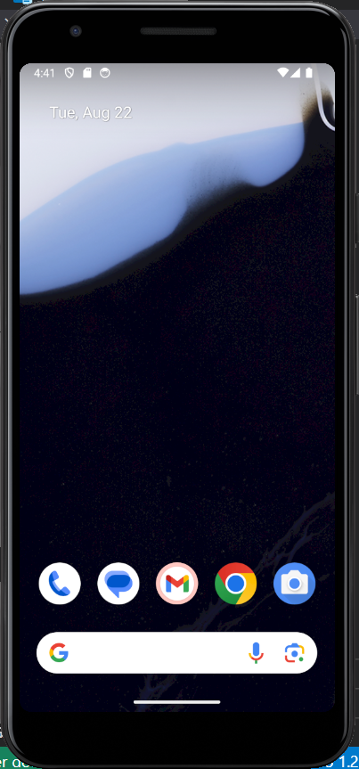
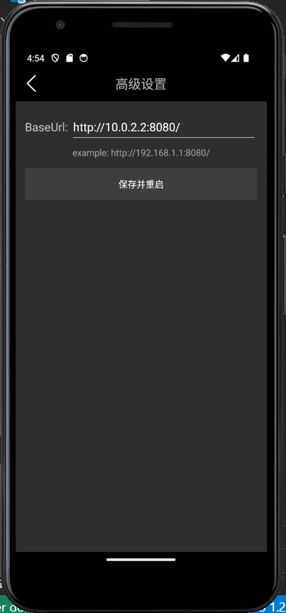

### 使用Dockerfile构建镜像
在Dockerfile所在目录下运行如下命令：
```shell
docker build -t douyin .
```
-t表示构建的镜像名，这里为douyin。.表示Dockerfile所在目录。
建议构建时开启全局代理，否则下载可能失败。

构建完成后运行命令：
```shell
docker images
```
可以看到一个名为douyin的镜像。

### 使用git clone项目
根据文档，后端项目demo的链接为https://github.com/RaymondCode/simple-demo

运行如下命令即可
```shell
git clone https://github.com/RaymondCode/simple-demo.git
```
假设项目被clone到目录(your absolute path to repo)
### 通过Dockerfile创建容器
运行如下命令，通过镜像douyin来创建容器：
```shell
docker run -it -v (your absolute path to repo):/home/douyin-demo -p 8080:8080 douyin /bin/bash
```
-i表示交互操作，-t表示终端，-v (path1):(path2)表示将主机path1挂载到容器内path2，-p (port1):(port2)表示将容器的8080端口绑定到主机的8080端口。
创建完成后，会显示终端。在终端中进入目录/home/douyin-demo，并用go命令构建项目可执行文件。
```shell
cd /home/douyin-demo
go build
```
可以看到目录中出现了可执行文件simple-demo。运行如下命令：
```shell
./simple-demo
```
可以看到后端成功运行，终端显示出gin库的日志，以及正在监听8080端口。

在浏览器中访问[http://127.0.0.1:8080/douyin/feed/](http://127.0.0.1:8080/douyin/feed/ "http://127.0.0.1:8080/douyin/feed/")。可以看到返回一个json。

### 安卓模拟器安装（以Android Studio为例）

**注意：** 该方法比较吃配置。如果电脑配置不高，可以使用雷电模拟器。

从[该链接](https://developer.android.com/studio "https://developer.android.com/studio")下载Android Studio软件并安装。

安装完成后，打开软件。按照[该链接](https://developer.android.com/studio/run/managing-avds?hl=zh-cn "https://developer.android.com/studio/run/managing-avds?hl=zh-cn")的方法新建一个虚拟设备。

我在试的时候打开Device Manager窗口后发现自带一个设备，就直接点击右侧的启动按钮，然后Android Studio下载了很多文件之后就可以启动了。后面的配置看起来很麻烦。

模拟器启动后如图所示：


将青训营文档中的app-release.apk拖入上述屏幕即可完成安装。教程见[该链接](https://developer.android.com/studio/run/emulator-install-add-files?hl=zh-cn "https://developer.android.com/studio/run/emulator-install-add-files?hl=zh-cn")

安装完成后可以在模拟器中找到抖声APP。

### 安卓模拟器（以雷电模拟器为例）


### 配置APP
打开APP后双击右下角的“我”，看到如下界面。



若安装Android Studio，根据[该链接](https://developer.android.com/studio/run/emulator-networking?hl=zh-cn "https://developer.android.com/studio/run/emulator-networking?hl=zh-cn")关于模拟器网络配置的说明，10.0.2.2代表主机的localhost。前面又已经将docker镜像暴露的8080端口与主机8080端口绑定了，所以填写链接如上图即可。

重启抖声APP，即可刷到一只熊的视频。