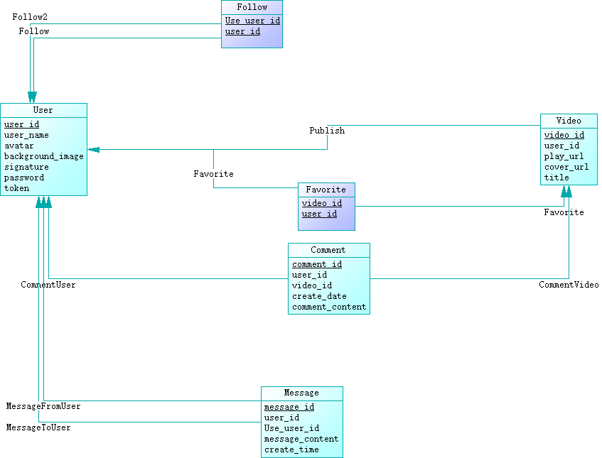

## mysql表设计
根据[项目文档](https://bytedance.feishu.cn/docx/BhEgdmoI3ozdBJxly71cd30vnRc "https://bytedance.feishu.cn/docx/BhEgdmoI3ozdBJxly71cd30vnRc")中的前后端通信Protobuf接口定义，进行数据表设计，区分哪些项是数据库中需要的，哪些项是可以通过ORM计算得到的。

### 一些注意点
* 不要把图片、视频和大段文字直接存到数据库里。学simple-demo把视频存到public文件夹，通过查到的url再让客户端重定向访问即可，并在gin中配置路由即可。

### PowerDesigner的使用方法
PowerDesigner是辅助设计关系型数据库的数据表的软件。它提供一套标准化流程，将现实世界中的数据之间的抽象关系一步步转换为具体数据库中的数据表。根据软件说明，一次转换主要分为下面几个阶段：
* **Conceptual Data Model：** A conceptual data diagram provides a graphical view of the conceptual structure of an information system, and helps you identify the principal entities to be represented, their attributes, and the relationships between them.
* **Logical Data Model：** A logical data model (LDM) helps you analyze the structure of an information system, independent of any specific physical database implementation. An LDM has migrated entity identifiers and is less abstract than a conceptual data model (CDM), but does not allow you to model views, indexes and other elements that are available in the more concrete physical data model (PDM).
* **Physical Data Model：** A physical data model (PDM) helps you to analyze the tables, views, and other objects in a database, including multidimensional objects necessary for data warehousing. A PDM is more concrete than a conceptual (CDM) or logical (LDM) data model. You can model, reverse-engineer, and generate for all the most popular DBMSs.

使用PowerDesigner软件设计出的PDM如下图：


根据上图生成的数据表见/database/crebas.sql。

### 开启mysqld服务
新建一个docker内的终端，运行下列命令：
```shell
mysqld --initialize --console
```
该命令会完成mysqld服务初始化配置，并生成一个暂时的root用户密码。
```
[Server] A temporary password is generated for root@localhost: (password)
```

接下来运行下列命令，打开mysqld服务。
```shell
mysqld -u root
```
然后关闭终端。

### 连接mysql服务并修改root用户密码
新建一个终端，输入下列命令：
```shell
mysql -u root -p
```
在输入密码界面输入上一节生成的密码(password)，登录成功后界面显示
```
Welcome to the MySQL monitor.  Commands end with ; or \g.
Your MySQL connection id is 9
Server version: 8.0.34

...

mysql>
```
输入下面的sql语句，将引号内的(new password)替换为新密码：
```sql
ALTER USER 'root'@'localhost' IDENTIFIED BY '(new password)';
```
修改完成后输入exit，即可退出mysql，后续使用root用户登录时均使用新密码即可。

### 将设计好的数据表导入mysql中
用修改后的密码登录mysql终端。首先使用下列语句新建数据库：
```sql
create database douyin;
```
其次使用下列语句，选择新建的数据库douyin：
```sql
use douyin;
```
最后输入下列命令，将设计好的数据表导入数据库中：
```sql
source ./database/crebas.sql;
```

### 为数据库创建初始User数据
我们可以从./simple-demo/controller/demo_data.go和user.go中分别获得一些项目的初始数据。现使用sql语句将其插入数据库。

user.go中有如下数据：
```go
// usersLoginInfo use map to store user info, and key is username+password for demo
// user data will be cleared every time the server starts
// test data: username=zhanglei, password=douyin
var usersLoginInfo = map[string]User{
	"zhangleidouyin": {
		Id:            1,
		Name:          "zhanglei",
		FollowCount:   10,
		FollowerCount: 5,
		IsFollow:      true,
	},
}
```
对比User数据表的定义：
```sql
/*==============================================================*/
/* Table: User                                                  */
/*==============================================================*/
create table User
(
   user_id              bigint not null,
   user_name            varchar(32) not null,
   avatar               char(64),
   background_image     char(64),
   signature            varchar(100),
   password             varchar(32) not null,
   token                varchar(64) not null,
   primary key (user_id)
);
```
编写出在数据表User中插入数据的sql语句：
```sql
insert into User values (1, "zhanglei", null, null, null, "douyin", "1234567");
```

demo_data.go中有如下数据：
```go
var DemoUser = User{
	Id:            1,
	Name:          "TestUser",
	FollowCount:   0,
	FollowerCount: 0,
	IsFollow:      false,
}
```
同样地，根据User表的定义，可以写出在数据表User中插入数据的sql语句：
```sql
insert into User values (2, "TestUser", null, null, null, "douyin", "1234567");
```
因id重复了，此处id设置2。

### 为数据库创建初始Video数据
demo_data.go中有如下数据：
```go
var DemoVideos = []Video{
	{
		Id:            1,
		Author:        DemoUser,
		PlayUrl:       "https://www.w3schools.com/html/movie.mp4",
		CoverUrl:      "https://cdn.pixabay.com/photo/2016/03/27/18/10/bear-1283347_1280.jpg",
		FavoriteCount: 0,
		CommentCount:  0,
		IsFavorite:    false,
	},
}
```
对比Video数据表的定义：
```sql
/*==============================================================*/
/* Table: Video                                                 */
/*==============================================================*/
create table Video
(
   video_id             bigint not null,
   user_id              bigint not null,
   play_url             char(64) not null,
   cover_url            char(64) not null,
   title                varchar(50) not null,
   primary key (video_id)
);
```
编写出在数据表Video中插入数据的sql语句：
```sql
insert into Video values (1, 2, "3214195939554309269", "10438559648169641774","熊出没");
```

### 为数据库创建初始Comment数据
demo_data.go中有如下数据：
```go
var DemoComments = []Comment{
	{
		Id:         1,
		User:       DemoUser,
		Content:    "Test Comment",
		CreateDate: "05-01",
	},
}
```
对比Comment数据表的定义：
```sql
/*==============================================================*/
/* Table: Comment                                               */
/*==============================================================*/
create table Comment
(
   comment_id           bigint not null,
   user_id              bigint not null,
   video_id             bigint not null,
   create_date          date not null,
   comment_content      varchar(300) not null,
   primary key (comment_id)
);
```
编写出在数据表Comment中插入数据的sql语句：
```sql
insert into Comment values (1, 2, 1, '2023-05-01', "Test Comment");
```

### 将设计好的数据导入mysql中
用修改后的密码登录mysql终端。首先使用下列语句新建数据库：
```sql
create database douyin;
```
其次使用下列语句，选择新建的数据库douyin：
```sql
use douyin;
```
最后输入下列命令，将设计好的数据表导入数据库中：
```sql
source ./database/initdata.sql;
```

（未完待续）